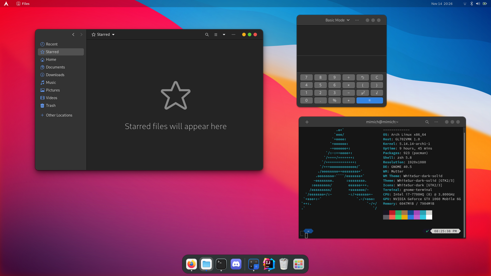

# My Dotfiles 

Os: [ArchLinux](https://archlinux.org/)

**App:**

- Shell: `Zsh`([OhMyZsh](https://github.com/ohmyzsh/ohmyzsh))
- Terminal: Gnome-Terminal
- Graphic-Environment: [Gnome](https://www.gnome.org/)
- Web-Browser: [FireFox](https://www.mozilla.org)
- Password-Manager: [BitWarden](https://bitwarden.com/)
- Image-Editor: [Gimp](https://www.gimp.org/)
- Video-Editor[DaVinci-Resolve](https://www.blackmagicdesign.com/products/davinciresolve)

**Graphic-Theme:**

- Application: [WhiteSur](https://github.com/vinceliuice/WhiteSur-gtk-theme)
- Cursor: [McMojave](https://github.com/vinceliuice/McMojave-cursors)

**Security:**
- Rkhunter
- [Clamv](https://www.clamav.net/)
- [TorBrowser](https://www.torproject.org/download/)

**Coding:**
**IDE:**
- [Intellij](https://www.jetbrains.com/idea/) `Java/Groovy/Kotlin/Scala/Web-language/Python`
- [CLion](https://www.jetbrains.com/clion/) `Arduino/C#/C++`

## Preview

